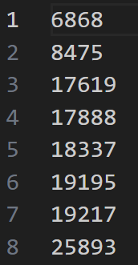

# 实验一 排序算法
## JL23112201 刘禹岐
### 实验内容
利用课上所学内容，排序n个元素，元素为随机生成的$0$到$2^{15}-1$之间的整数，n的取值为：$2^{3}$，$2^{6}$，$2^{9}$，$2^{12}$，$2^{15}$，$2^{18}$。
需要实现的算法：直接插入排序，堆排序，快速排序，归并排序，计数排序。
### 实验设备和环境
个人PC机
操作系统：Window11
指令集：x86
处理器：12th Gen Intel(R) Core(TM) i9-12900H   2.50 GHz
采用的编程语言：C++
### 实验方法和步骤
1. 将五个排序算法采用C++语言进行函数实现，分别为insert_sort heap_sort quick_sort merge_sort counting_sort；
2. 生成随机数据，采用C++的rand种子，生成400000个伪随机数存放在input.txt中；
3. 对每一种排序算法进行测试，分别对问题规模为$2^{3}$，$2^{6}$，$2^{9}$，$2^{12}$，$2^{15}$，$2^{18}$进行排序求解，排序结果存放在相应文件夹中result_N.txt文件中；因为只排序一次的时间太短，计算机的计时函数达不到微秒以下的精度，因而对于一些输出运行时间为0的排序过程进行多次重复排序，从而规定下面的运行时间都是对任一问题规模下执行相同序列10000次排序的总运行时间，并将六个规模的运行时间存放在相应文件夹下的time.txt文件中；
### 实验结果及其分析
#### 直接插入排序
**排序结果**

>观察分析六次的输出结果可以证明算法排序功能是正确的。

**运行时间**

转化为图表后如下：

>注：其中对上面的运行时间进行了归一化后倍化6倍，显得比较更加明显；
分析：首先可以看到当问题规模增大时，运行时间能直逼$O(n^2)$量级，算法效率很差，但在问题规模较小时，因其实现简单从而也可以使用；

#### 堆排序
**排序结果**

>观察分析六次的输出结果可以证明算法排序功能是正确的。

**运行时间**

转化为图表后如下：

>注：其中对上面的运行时间进行了归一化；
分析：当问题规模增大时，可以近似看作运行时间曲线在$n$和$n^2$之间，也就是$O(nlgn)$量级

#### 快速排序
**排序结果**

>观察分析六次的输出结果可以证明算法排序功能是正确的。

**运行时间**

转化为图表后如下：

>注：其中对上面的运行时间进行了归一化；
分析：发现和归并排序的图像很接近，也是$O(nlgn)$量级，但通过分析数据可以知道快速排序是较优于堆排序的，其用的时间更少

#### 归并排序
**排序结果**

>观察分析六次的输出结果可以证明算法排序功能是正确的。

**运行时间**

转换为图表后如下：

>注：其中对上面的运行时间进行了归一化；
分析：同样符合$O(nlgn)$量级

#### 计数排序
**排序结果**

>观察分析六次的输出结果可以证明算法排序功能是正确的。

**运行时间**

转换为图表后如下：

>注：其中对上面的运行时间进行了归一化；
分析：从图中可以看到，在n = 6和n = 5的时候存在拐点，也就是说时间复杂度从$O(k)$转移到了$O(n)$，当规模不超过数的范围k的时候，运行时间近乎不变，这一点也可以从数据中得出，所以转换为图表之后近乎为一条直线，符合预期；

#### 不同的排序算法之间的比较
**运行时间图表**

>在问题规模较小时，分析上图可以看到计数排序运行效果差于其他四种排序算法；

>当问题规模进一步增大时，merge_sort的运行时间开始上升，随后的是heap_sort quick_sort insert_sort，同时计数排序依然效果最差；

>当问题规模再增大时，insert_sort的运行时间急剧上升，性能急剧下降，其他排序算法同样运行时间增加，但此时计数排序便显示出自己线性运算时间的优势了；
