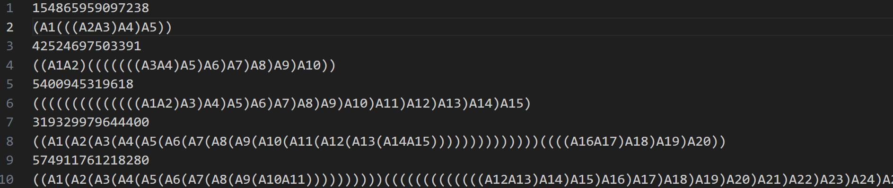
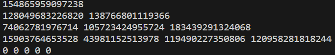
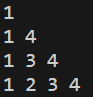
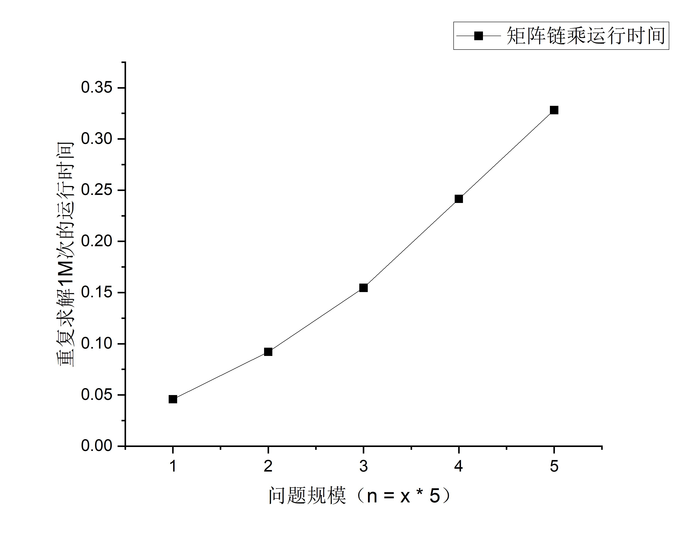
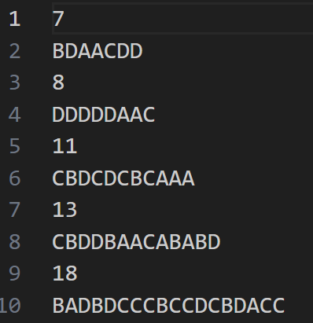
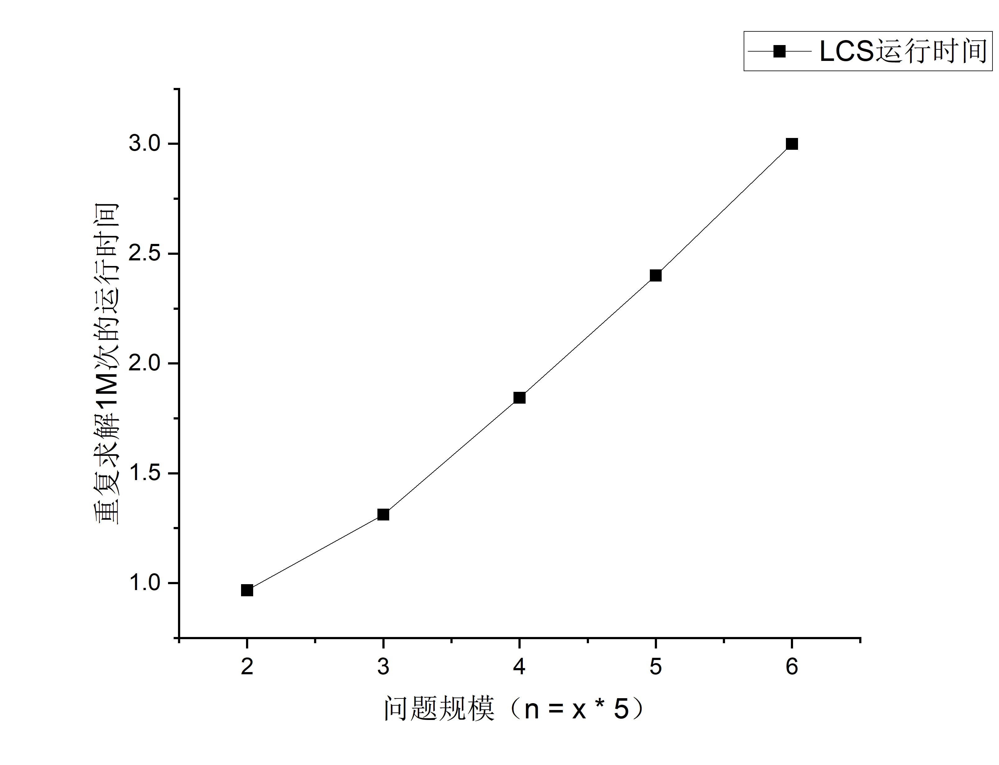

# 实验二 动态规划
## JL23112201 刘禹岐
### 实验内容
利用动态规划原理，求解矩阵链乘最佳次序问题和最长公共子序列问题，并记录运行时间和相应的性能分析。

### 实验要求
**矩阵链乘实现**
问题规模n的取值5, 10, 15, 20, 25；计算过程，所给数据求出的乘法运算次数变量可能超出int类型，但在long long范围内。

**LCS问题**
X, Y序列由A、B、C、D四种字符构成,序列长度分别取10、15、20、25、30。

### 实验设备和环境
个人PC机
操作系统：Window11
指令集：x86
处理器：12th Gen Intel(R) Core(TM) i9-12900H   2.50 GHz
采用的编程语言：C++

### 实验方法和步骤
1. 生成对应问题数据，其中矩阵链乘问题由指定文件给出，只需要随机生成LCS问题的数据即可；
2. 实现对应的求解问题的DP算法；
3. 根据输出信息判断算法是否正确及其对其性能进行分析。

### 实验结果及其性能分析
#### 矩阵链乘
实验输出结果如下：

>上面两张为n = 5时的子问题结果图

**性能分析**

>矩阵链乘的DP算法理论时间复杂度为$Ω(n^3)$，虽然光看曲线图并没有$(n^3)$的趋势，但是当问题规模再进一步增大时，可能就会表现出急剧上升的趋势。
可以将代码中的COUNT改为更大的值，当改成100M时，电脑直接给我宕机了，但观察时间的趋势近乎$Ω(n^3)$趋势。

#### LCS
实验输出结果如下：

**性能分析**

>LCS的DP算法理论时间复杂度为$O(mn)$，同样和矩阵链乘算法一样通过曲线看出来很像一个线性函数，但是当问题规模再进一步增大时，可能就会表现出急剧上升的趋势。