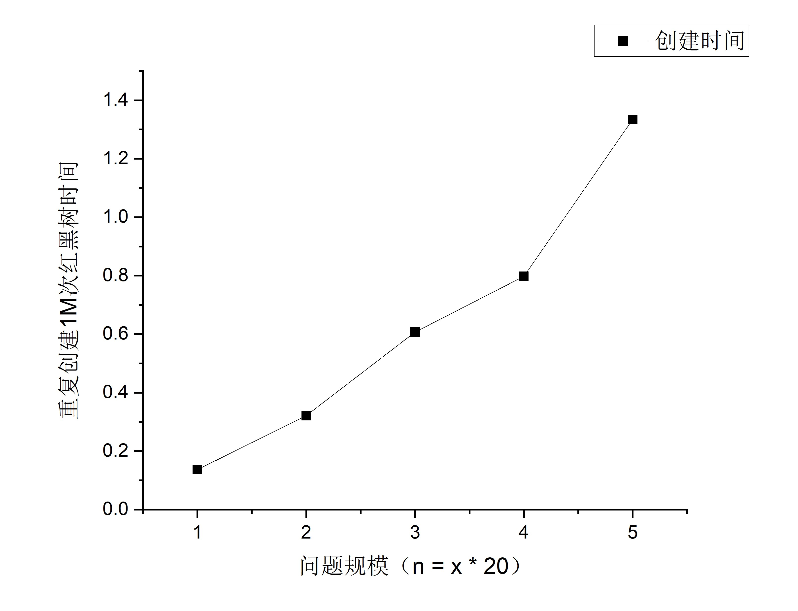
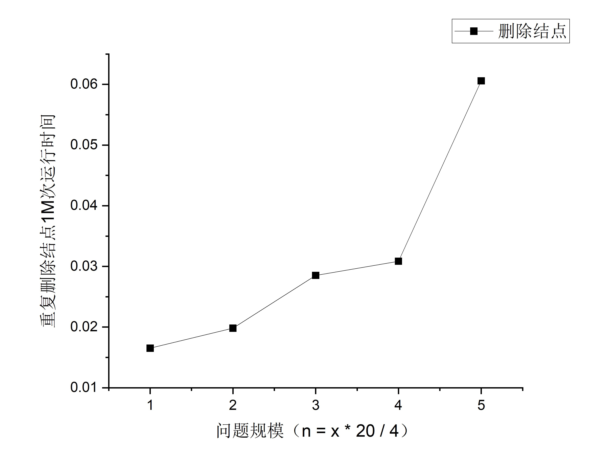

# 实验三 红黑树
## JL23112201 刘禹岐
### 实验内容
实现红黑树的基本算法， 分别对整数 n =20、40、60、80、100，随机生成n个互异的正整数（K1, K2, K3, ……, Kn）, 以这n个正整数作为结点的关键字，向一棵初始空的红黑树中依次插入n个节点，统计算法运行所需时间 ，画出时间曲线。
随机删除红黑树中n/4个结点，统计删除操作所需时间，画出时间曲线图。

### 实验设备和环境
个人PC机
操作系统：Window11
指令集：x86
处理器：12th Gen Intel(R) Core(TM) i9-12900H   2.50 GHz
采用的编程语言：C++

### 实验方法和步骤
1. 生成每一个规模对应的键值数据，用于根据这些键值创建红黑树；
2. 实现红黑树数据结构；
3. 记录时间和中序遍历后的数据，以此分析算法是否正确及其性能，效率如何；
   
### 实验结果及其性能分析
#### 中序遍历输出结果
```
1 22 43 60 127 278 355 393 455 474 566 636 654 714 771 784 789 800 877 976 

90 140 169 176 186 245 298 339 348 349 356 364 378 388 392 454 474 487 496 500 520 606 678 685 694 695 700 724 759 759 783 783 841 875 892 906 911 935 962 995 

16 20 65 67 87 105 106 106 118 147 195 196 205 215 230 234 258 286 301 315 319 336 355 372 386 422 426 442 443 452 489 497 508 516 521 532 547 572 575 582 589 590 612 623 631 642 650 705 728 741 779 795 795 806 875 881 909 939 949 964 

46 48 54 65 93 110 116 124 126 133 134 179 204 214 250 269 274 278 291 298 300 307 313 318 321 330 335 346 373 409 414 419 446 450 455 467 496 531 545 552 564 565 577 583 590 592 593 605 619 625 632 650 667 692 725 734 751 771 783 789 805 813 813 821 831 837 849 867 892 907 931 937 949 951 960 965 969 973 974 978 

9 14 29 58 60 61 61 61 77 88 98 106 112 131 133 139 155 160 169 174 191 204 209 238 241 243 247 259 259 281 290 296 300 300 305 346 363 366 378 378 385 386 404 425 425 434 435 458 470 471 484 521 545 549 575 581 582 584 596 598 655 664 672 684 684 684 698 717 720 727 733 738 746 751 760 769 774 781 783 784 784 788 796 812 818 819 828 833 834 837 861 862 870 880 901 931 941 953 963 982 
```
>创建红黑树进行中序遍历的结果，算法正确；

```
1 22 43 60 127 278 355 654 714 771 784 789 800 877 976 

90 140 169 176 186 245 298 339 348 349 356 364 378 388 392 454 700 724 759 759 783 783 841 875 892 906 911 935 962 995 

16 20 65 67 87 105 106 106 118 147 195 196 205 215 230 234 258 286 301 315 319 547 572 575 582 589 590 612 623 631 642 650 705 728 741 779 795 795 806 875 881 909 939 949 964 

46 48 54 65 93 110 116 124 126 133 134 179 204 214 250 269 274 278 291 298 300 307 313 318 321 330 335 346 373 409 414 419 446 450 455 467 496 771 783 789 805 813 813 821 831 837 849 867 892 907 931 937 949 951 960 965 969 973 974 978 

9 14 29 58 60 61 61 61 77 88 98 106 112 131 133 139 155 160 169 174 191 204 209 238 241 243 247 259 259 281 290 296 300 300 305 346 363 366 378 378 385 386 404 425 425 434 435 458 470 760 769 774 781 783 784 784 788 796 812 818 819 828 833 834 837 861 862 870 880 901 931 941 953 963 982 
```
>创建后分别删除四分之一规模的结点，中序遍历的输出结果，算法正确；

#### 性能分析


>分析上述两张图可以看出，创建和删除结点的曲线趋势相近，从而时间复杂度可以近似为同一数量级；
仅看趋势分析，确实比线性高一些，但不接近$O(n^2)$量级，和理论$O(nlgn)$接近。