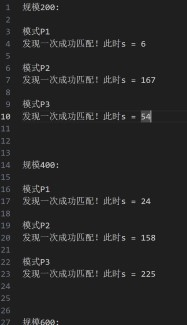
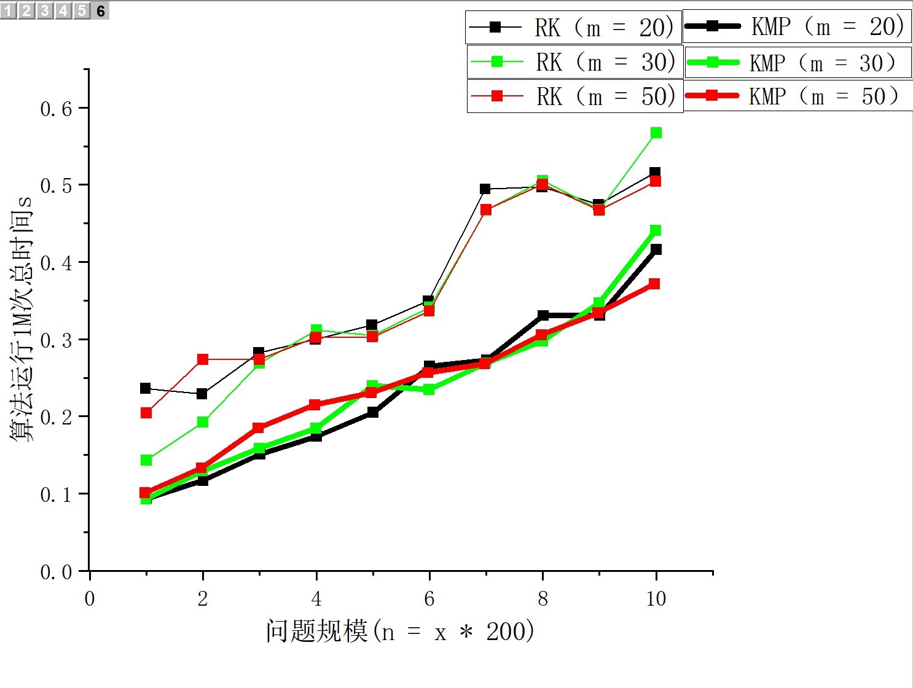

# 实验四 串匹配算法
## JL23112201 刘禹岐
### 实验内容
通过C/C++语言编写函数来实现Rabin-Karp和Knuth-Morris-Pratt算法，用于在文本中查找模式串并返回匹配的位置或者数量，以此来测试不同算法在各种情况下的性能表现，对比RK和KMP算法的性能和效率，分析它们在不同情况下的表现，并得出结论。

### 实验要求
不同长度的文本串和模式串：文本串的长度依次为200、400、600、...、1800、2000，模式串长度分别为20、30、50；
采用随机字符串的模式生成文本串和模式串（字符集为∑={a,b,...,z}）。

### 实验设备和环境
个人PC机
操作系统：Window11
指令集：x86
处理器：12th Gen Intel(R) Core(TM) i9-12900H   2.50 GHz
采用的编程语言：C++

### 实验方法和步骤
1. 首先生成所需数据，即`input.txt`内容；通过随机生成随机数的方法，对任意取模将其映射到小写字母ASCII码97-122的范围；
2. 根据RK算法和KMP算法编写对应的函数进行实现；
3. 通过多次调用RK算法和KMP算法来得到其匹配结果和运行时间；
4. 研究其匹配结果是否正确并分析其运行时间即性能和效率如何。
   
### 实验结果及其分析
#### RK算法和KMP算法运行结果
根据分析对应文件夹下面的`result.txt`，得出算法实现正确。

>因为太长了，就不在这里进行展示了。

#### 运行时间分析
对其运行时间处理后的到如下图表：

>可以看出在整体上，KMP算法优于RK算法，运行时间优于RK算法且稳定性好，偏差不大，而RK算法的曲线有一些地方的陡，来回的波动大；
当问题规模变大时，RK算法和KMP算法的运行时间都渐进线性函数，KMP算法预处理时间是O(m)，求解时间是O(n)，大致上满足于理论值；RK算法最坏情况下是O(mn)，从而这就可能导致这条曲线波动很大，但相较来说性能和效率还是不错的。
